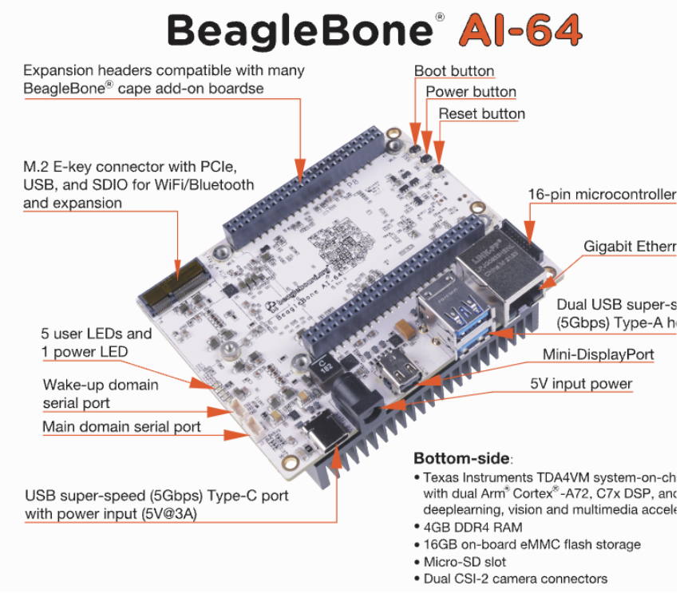
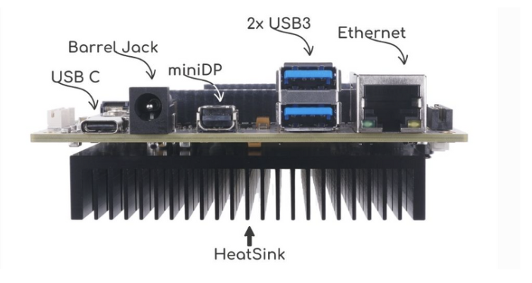
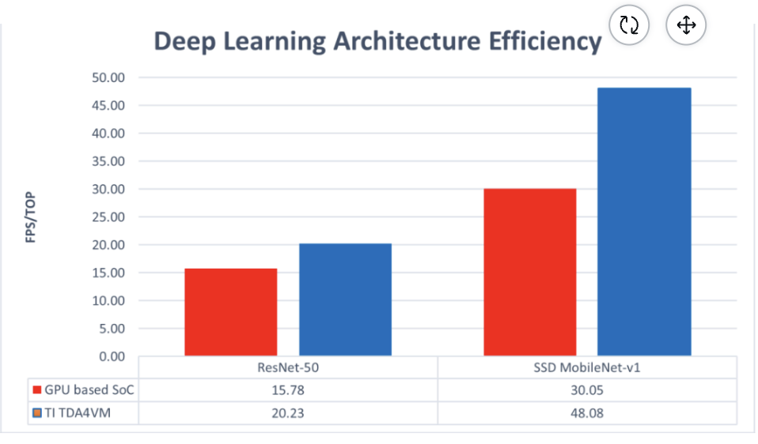

# GSoC2024-Enhanced Media Experience with AI-Powered Commercial Detection and Replacement

## Motivation behind the project

The primary motivation behind this project is to enhance the media consumption experience by providing users with control over the content they see during commercial breaks. Advertisements can often be disruptive, irrelevant, or inappropriate for the viewing context.

For instance:

- Say, we are watching a sports match or a comedy movie and suddenly encounter an ad for a horror movie or a crime drama, this can be jarring and can negatively impact the viewing experience.

- Also, Certain advertisements may contain content that is disturbing or unsuitable for all audiences, especially when watching with children.

By developing a system that detects and replaces commercials in real-time, this project aims to ensure that viewers can enjoy a seamless and pleasant viewing experience, tailored to their preferences. Also it will serve as an educational resource on integrating AI and machine learning capabilities into embedded systems.

## Project Goals

The project has 3 main components:

- Creating a Deep Learning Model:

  - Create a dataset consisting of Commercials and Non-Commercial Videos.
  - Design and train a model architecture that detects commercials in real-time.
  - Evaluate the model’s performance.

- Implementing a GStreamer plugin:

  - Create a custom GStreamer plugin for the Beaglebone AI-64 that utilizes the trained model to detect commercials in real-time.
  - Configure the plugin to replace commercials with alternative content or obfuscate them, and replace the audio with predefined streams.

- Optimizing for BeagleBoard:

  - Ensure that the entire system is optimized for real-time performance on BeagleBoard hardware.

## BeagleBone AI-64

<a href="https://docs.beagleboard.org/boards/beaglebone/ai-64/ch04.html" target="_blank">Source</a>

BeagleBone® AI-64 brings a complete system for developing artificial intelligence (AI) and machine learning solutions with the convenience and expandability of the BeagleBone® platform and the peripherals on board to get started right away learning and building applications. The hardware supports real-time H.264 and H.265 (HEVC) video encoding and decoding. Typical performance metrics indicate the capability to handle 1080p streams at 60 frames per second (fps) or multiple 720p streams simultaneously.

### Connections

<a href="https://docs.beagleboard.org/boards/beaglebone/ai-64/ch03.html" target="_blank">Source</a>

For the project, I'll take input of media from an HDMI source and, after processing it, the output will be displayed on a monitor using a miniDP to HDMI cable.

## Why BeagleBone AI-64?

Using BeagleBone AI-64 hardware is a key aspect of this project, offering several benefits:

- The BeagleBone AI-64 is powered by the Texas Instruments TDA4VM processor, which includes multiple high-performance Arm Cortex-A72 cores and Cortex-R5F cores. This provides significant processing power for running complex inferencing algorithms.
- The TDA4VM processor integrates a dedicated deep learning accelerator (DLA), which significantly boosts the performance of AI inferencing tasks. It can accelerate the inferencing of deep learning models by offloading and parallelizing computation-intensive operations, thus reducing the time required for each inference.
- The hardware’s architecture and support for various multimedia processing frameworks, such as GStreamer, make it an ideal choice for developing and running the proposed system efficiently.

<a href="https://www.ti.com/lit/an/spracz2/spracz2.pdf?ts=1716900138738&ref_url=https%253A%252F%252Fwww.google.com%252F" target="_blank">Source</a>

We can see from the above comparison that TDA4VM is up to 60% better in terms of FPS/TOPS efficiency. What this means is that 60% less TOPS are needed to run equivalent deep learning functions.

## Commercial Detection Model

Deep learning is a subset of machine learning that involves neural networks with many layers, known as deep neural networks. Each layer of the network extracts increasingly abstract features from the input data, enabling the system to understand and generate intricate representations.

For the project, I'll develop an audio-visual CNN model that combines Mel-spectrogram data from audio with frames extracted from videos as its input. To extract features, I'll utilize well-known CNN architectures like MobileNetV2, InceptionV3, and DenseNet169. Ultimately, I'll merge the features obtained from the audio and visual components and then conduct classification based on these merged features and then will train the model accordingly.

## GStreamer

GStreamer is a powerful open-source multimedia framework that provides a pipeline-based system for constructing media applications. It allows developers to create, edit, and play various types of multimedia content, including audio, video, and streaming media. One of the key features of GStreamer is its plugin-based architecture, which allows developers to extend its functionality by adding new plugins for different media formats, codecs, and processing elements.

In the project, I will create a GStreamer Plugin that will receive input from an HDMI source and will use the trained model to inference whether the current frame belongs to commercial or not. If a commercial video is detected, it will apply blurring to the video frames and replace the audio.

## Benefits of this Project

- This project aims to improve both the media consumption experience for BeagleBoard hardware users and serve as an educational tool for integrating AI and machine learning into embedded systems.
- It offers valuable insights into deploying neural network models in resource-constrained environments, creating custom GStreamer plugins for multimedia processing, and applying machine learning in real-world scenarios to enhance digital media experiences.
- Moreover, it enhances the viewing experience by automatically detecting and replacing commercials with preferred content, ensuring uninterrupted entertainment.

Thank you for reading the complete blog!!

##### To Explore more about the project refer the following Links:

- Youtube Video **[Link](https://www.youtube.com/watch?v=Kagg8JycOfo)**
- Project Details **[Link](https://forum.beagleboard.org/t/enhanced-media-experience-with-ai-powered-commercial-detection-and-replacement/37358)**
- Gitlab Repo **[Link](https://openbeagle.org/aryan_nanda/gsoc_2024-enhanced_media_experience_with_ai-powered_commercial_detection_and_replacement)**
- My proposal **[Link](https://gsoc.beagleboard.io/proposals/commercial_detection_and_replacement.html)**
- Blogs **[Link](https://aryannanda17.github.io/Blogs/)**
